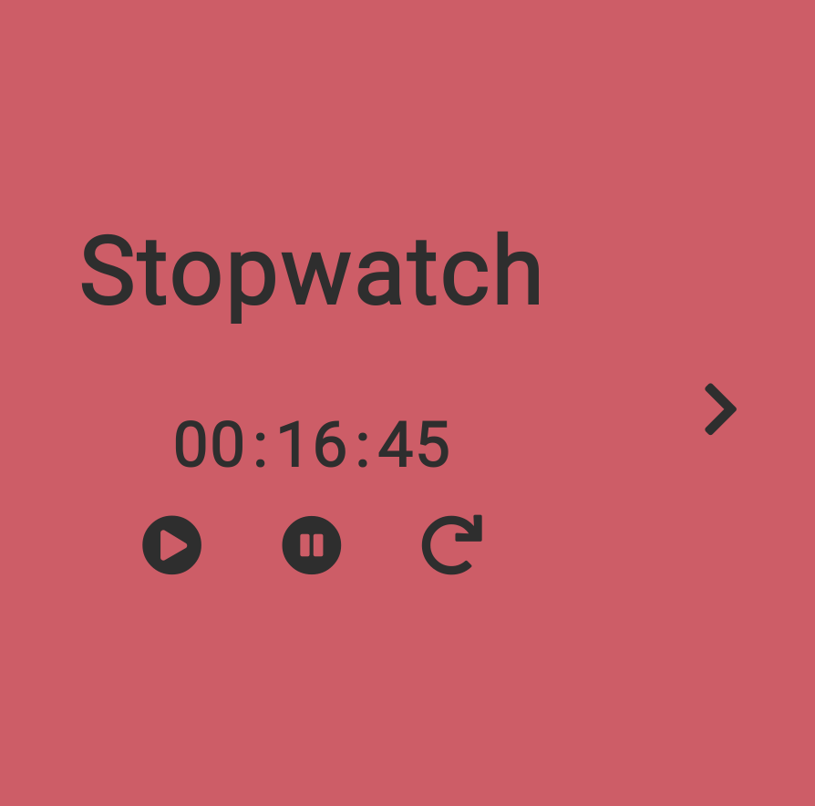
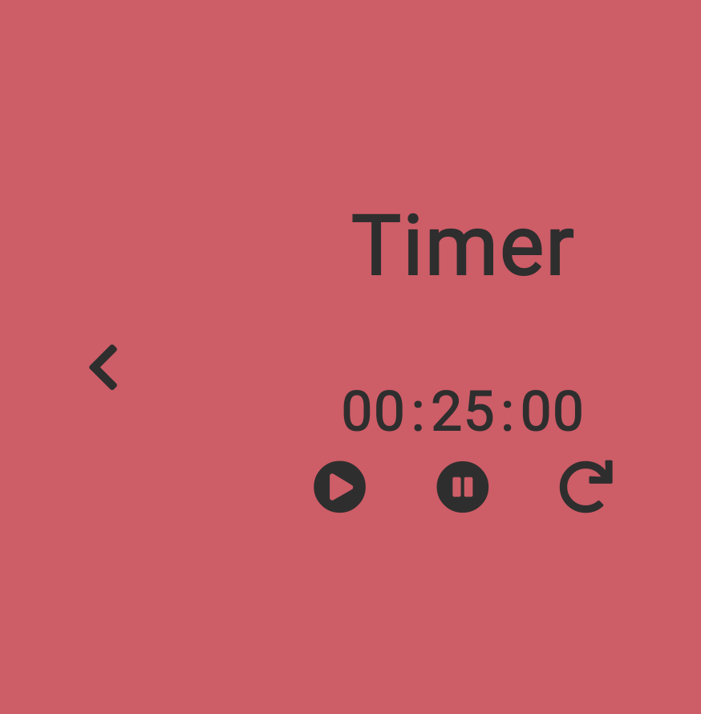

# JavaScript Stopwatch / Timer

> Written For Concordia University

  
  

 

## Demo

[View the Live Demo](https://andrewbaldwin44.github.io/JavaScript_Stopwatch_Timer/)

## Features

1. Controls to play, pause and restart the timer or stopwatch
2. A sound will play when the timer runs out
3. View the current time in the tab bar
4. Set the timer with a custom made time selector
5. The app is fully responsive. Enjoy on any device!

## Deploy the project

**Clone the repo to your local machine using the terminal**:

    $ git clone git@github.com:andrewbaldwin44/Javascript_Stopwatch_Timer.git

_Then Open the `index.html` Project File in Your Browser_

### Technologies Used:

-   JavaScript
-   HTML
-   CSS

## Author

👤 **Andrew Baldwin**

-   Github: [@andrewbaldwin44](https://github.com/andrewbaldwin44)
